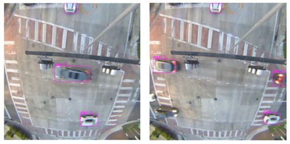
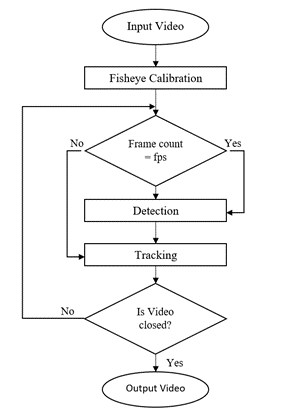
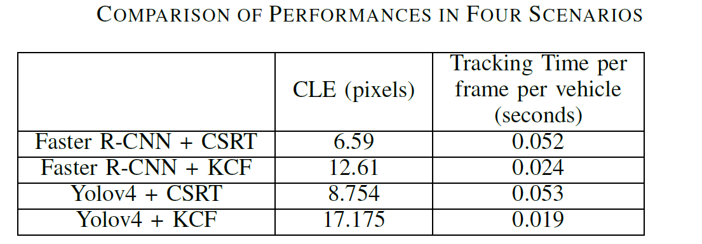

# A Detection And Tracking System For Fisheye Videos From Traffic Intersections

- The project aims to present a comprehensive system for detecting and tracking vehicles in fisheye videos obtained from traffic intersections.
- The system calibrates fisheye videos into perspective views, then feeds processed videos into pre-trained detection model and tracking algorithms to handle tasks such as vehicles counts or path data collection.
- The system's performance is evaluated using metrics including mean average precision, center location error and processing time.

<div align="center">
  
</div>
<br>


### Table of Contents
- [Project sections](#project-sections-)
- [Installation Requirements](#install-req-)
- [Useage](#useage-)
- [Weight Files](#weight-)
- [Test Files](#test-)
- [Publication information](#publication-)


## Project sections <a name="project-sections-"></a>
The project implements the following:

### 1. Fisheye Video Calibration

- This part takes care of the raw fisheye videos/images. We apply [Bourke](http://paulbourke.net/dome/fish2/)'s model and developed a Python wrapper to integrate with OpenCV library. Output videos are resized into 1000 x 1000.

### 2. Detection

- We use Yolov4 and Detectron2's implementation of Faster R-CNN to detect the vehicles in our videos/images.

### 3. Tracking

- Two tarcking algorithms are implemented in our system: CSRT and KCF.

### 4. Tracking System

- Flowchart:
<div align="center">
  
</div>
<br>
- After calibration, we perform detection on the framw based on fps rate. For each bbox, a tracker is added and the new most likey bbox of it will be returned though update function. When next detection phase, we can determine whether the vehicle exists or not.

### 5. Performance

- The video is collected by a Gridsmart System’s Bell Camera with fisheye lens. This camera has a resolution of 2560 × 1920 and a FOV of 180°. The test machine is Intel Core i7-7800X processor with an NVIDIA RTX 2080 GPU.
-
  <div align="center">
    
  </div>
  <br>


## Installation Requirments <a name="install-req-"></a>
1. LIBJEPG
2. Yolov4 [darknet](https://github.com/AlexeyAB/darknet)
3. Detectron2 [detectron2](https://github.com/facebookresearch/detectron2)


## Useage <a name="useage-"></a>
1. Run fish_img.py/fish_video.py to covnert a fisheye imagery/video
2. Download the weight files and put them inside the track folder
3. Modify the input video path to the convert video in the track folder
4. Run main.py

## Weight Files <a name="weight-"></a>
[yolo](https://drive.google.com/file/d/1Zv09wHEFFCeh0nuCtSFfq6QlM35DPxcY/view?usp=sharing)
[detectron2](https://drive.google.com/file/d/1nJBU6yKydEzAmOYYFUTAHYA5ytyKxXAL/view?usp=sharing)

## Test files <a name="test"></a>
Test imagery and video are included. [video](https://drive.google.com/file/d/1UfA7xOOc2zDEMO_QJl0M7KCMptu2tEEg/view?usp=sharing)
If you want to test your own data, make sure to modify the filepath.

## Publication Information <a name="publication-"></a>
* Paper : https://ieeexplore.ieee.org/stamp/stamp.jsp?tp=&arnumber=9764081&isnumber=9763889
* Citation:

```BibTex
@INPROCEEDINGS{9764081,
  author={Wang, Yizheng and ElAarag, Hala},
  booktitle={SoutheastCon 2022}, 
  title={A Detection And Tracking System For Fisheye Videos From Traffic Intersections}, 
  year={2022},
  volume={},
  number={},
  pages={427-433},
  doi={10.1109/SoutheastCon48659.2022.9764081}}
```
